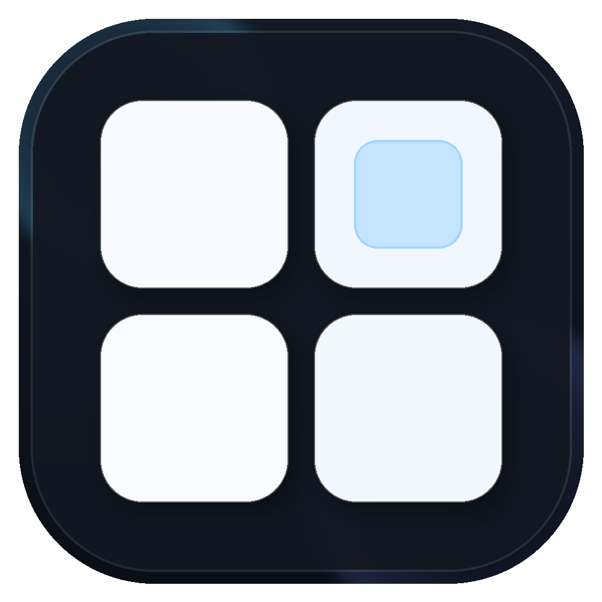

  

# TilePilot

TilePilot is a native macOS menu bar app that makes `yabai` + `skhd` practical for everyday use.

## What You Can Do

- Tile or float windows without touching terminal commands
- Control default behavior (`Manual Tiling`, `Hover Focus`, `Cursor Follows Focus`)
- Set per-app rules (`Never Tile`, `Always Tile`)
- Learn and run shortcuts from a GUI
- Edit `yabairc`, `skhdrc`, and helper scripts in one place
- Recover quickly when setup or services drift

## Requirements

- macOS 13+

## Main UI Areas

- `TilePilot` (main view): windows/desktops overview + focused window controls
- `Window Behavior`: global default tiling mode, hover focus, app rules
- `Actions & Shortcuts`: unified controls list with shortcut learning + quick actions
- `Config Files`: raw editing for `yabairc`, `skhdrc`, and referenced scripts
- `System`: essentials checklist + direct fix actions
  - Advanced sections (collapsed by default): managed `skhdrc` editor, diagnostics logs

## Install (Binary)

1. Download the latest DMG from [Releases](https://github.com/nostitos/TilePilot/releases/latest).
2. Drag `TilePilot.app` into `Applications`.
3. Open TilePilot and use the `System` tab for first-time setup checks.

## Dependencies

TilePilot can bootstrap common dependencies on a fresh Mac:

- `Homebrew`
- `yabai`
- `skhd`

Manual approvals still required:

- Accessibility permissions (macOS)
- Some Mission Control settings
- Optional scripting-addition setup for advanced desktop/window controls

## Desktop Switching Reality (Important)

- On many systems, `yabai -m space --focus` needs yabai scripting addition support.
- Without scripting addition, direct desktop focus commands can fail even if yabai/skhd are installed.
- TilePilot falls back to:
  1. focusing an existing window on the target desktop,
  2. then macOS Mission Control desktop shortcuts (if configured).
- For reliable no-SIP desktop jumps, set macOS shortcuts in:
  `System Settings -> Keyboard -> Keyboard Shortcuts -> Mission Control`.

## Scripting Addition + SIP (Advanced)

Some advanced desktop actions (especially moving windows between desktops) depend on yabai’s scripting addition, which may require partial SIP changes depending on macOS version/hardware; TilePilot can launch repair/install helpers, but it cannot change SIP or bypass Recovery Mode/security constraints. Review official guidance before enabling it: <https://github.com/koekeishiya/yabai/wiki/Disabling-System-Integrity-Protection>.

## Interactive Window Badges

- TilePilot shows a small state badge on the focused window and optional state outlines.
- Left-click a badge to toggle that window between `Floating` and `Auto-Tiled`.
- Right-click a badge for explicit actions:
  - `Set Floating`
  - `Set Auto-Tiled`
  - `Toggle Floating/Auto-Tiled`
  - `Focus Window`
- Overlay toggles are available from the menu bar quick menu:
  - `Window Badges`
  - `Window Outline Overlay`

## Feature Shortcuts (Unified)

- TilePilot now treats screen-wide controls and regular controls as one shortcut feature list.
- `Actions & Shortcuts` can show controls even when no shortcut is currently assigned.
- You can pin feature controls directly to the right-click menu.
- Screen-wide controls appear in the right-click menu only when pinned.
- Shortcut assignment is saved in the TilePilot-managed `skhdrc` section (non-managed lines are preserved).
- If a shortcut combo conflicts with an existing binding, TilePilot blocks save and suggests alternatives.

## Release Defaults Profile

- Each binary release ships a versioned TilePilot defaults profile.
- On a fresh install, TilePilot applies that profile once (pins, toggles, and TilePilot-managed config sections).
- On upgrades, TilePilot keeps your settings unchanged.
- Use `System` -> `Reset to Release Defaults (...)` to force-apply the latest shipped defaults.
- Reset scope is safe: only TilePilot app state plus TilePilot-managed `skhdrc`/`yabairc` sections are touched.

## Notes

- TilePilot preserves your existing `yabairc` and `skhdrc` content outside the app-managed blocks.
- TilePilot-managed config blocks use `TILEPILOT ...` markers.
- `Shift + Option + M` now targets `auto-layout-current-desktop.sh` (grid-based, keeps windows floating). `readable-current-space.sh` remains as a compatibility alias.
- `Grid Tiling (Floating)` keeps windows floating in a packed grid.
- `Grid -> Auto-Tile (BSP)` returns windows to real managed tiling (BSP).

## Developers

Build, packaging, and signing details are in:

- [Development Notes](docs/DEVELOPMENT.md)
